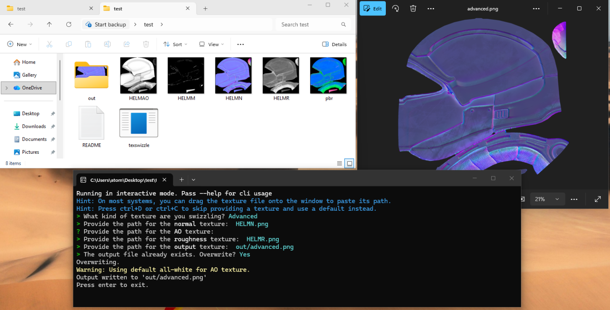

# TexSwizzle
## About
Swizzle textures into composite Helldivers 2 textures. Any required texture that is omitted will instead use a sensible default. Textures are automatically scaled to the size of the largest input.

Supported texture outputs: (more on request)
- Basic PBR
- Advanced PBR

## Why?
Most people use GIMP to do this by manually aligning the channels and then merging them there. This is a waste of time for anyone making a large number of textures. This simplifies that process and allows automation.

## TLDR Usage
1. Download `texswizzle.exe` from the [releases](https://github.com/ARoese/texswizzle-rs/releases/latest) page
2. Put it wherever you want. Paths will be relative to the exe, though.
3. Double-click the exe and select your desired output texture type using the arrow keys
4. Drag the images onto the window in the order it asks for them
   - Press enter to submit the path
5. Enter your output file name.

## Interactive Mode
Passing `--interactive` on the commandline will cause texswizzle to prompt for the paths and texture types instead of requiring them as cli arguments. This will probably be more comfortable for nontechnical users.

## CLI usage
Passing `--help` on the commandline will show cli usage. The program will run in interactive mode if nothing or `--interactive` is passed.

Use the --metallic, --normal, --roughness, --ao, and --emissive options to provide textures that will be swizzled. Use --basic or --advanced to produce a basic or advanced pbr respectively.

Any textures that were required for an output, but were omitted, will use defaults. For example, omitting the --normal option when creating an --advanced PBR will behave as if an all-flat normal was provided. All-flat means \[128, 128, 255] pixel values.

Textures do not have to be the same size. The output will be the same dimensions
as the largest input, and the smaller inputs will be upscaled using the 'nearest'
sampling method.

## Examples
The basic CLI usage is to specify the output format using either `--basic` or `--advanced`  

The basic+ PBR is composed of the following textures:
- roughness
- metallic
- ambient occlusion
- emissive

Thus, the composite textures are passed on the command line as such:  
`texswizzle --metallic MetallicMap.png --roughness Roughness.png --ao AOMap.png --basic basic_pbr.png --emissive EmissiveMap.png`  

Note that if you don't care to have emissive features on the texture, you can let texswizzle use a default all-white texture for you. It will always let you know when it does this.  
`texswizzle --metallic MetallicMap.png --roughness Roughness.png --ao AOMap.png --basic basic_pbr.png --emissive EmissiveMap.png`

### Other Examples
#### Basic PBR with full-white emissive
`texswizzle --metallic MetallicMap.png --roughness Roughness.png --ao AOMap.png --basic basic_pbr.png`  
#### Advanced PBR
`texswizzle --normal NormalMap.png --ao AOMap.png --roughness Roughness.png --advanced advanced_pbr.png`
#### Advanced PBR with default normal map:
`texswizzle --ao AOMap.png --roughness Roughness.png --advanced advanced_pbr.png`
